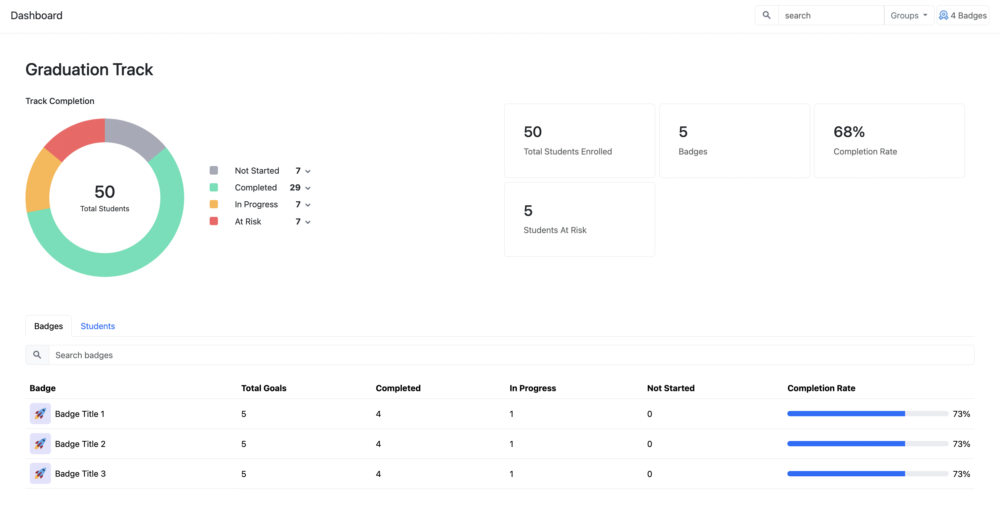

# SchoolJoyDemo

This project was generated using [Angular CLI](https://github.com/angular/angular-cli) version 19.2.13.

## Setup

After cloning or downloading the project, run the following command to install all dependencies:

```bash
npm install
```

## How to start

To start a local development server, run:

```bash
npm start
```

## After starting the project

Once the project is started go to:

```bash
http://localhost:4200/
```

## Preview



Thank you!!

```bash
Developer by Aditya Adhikari
```
